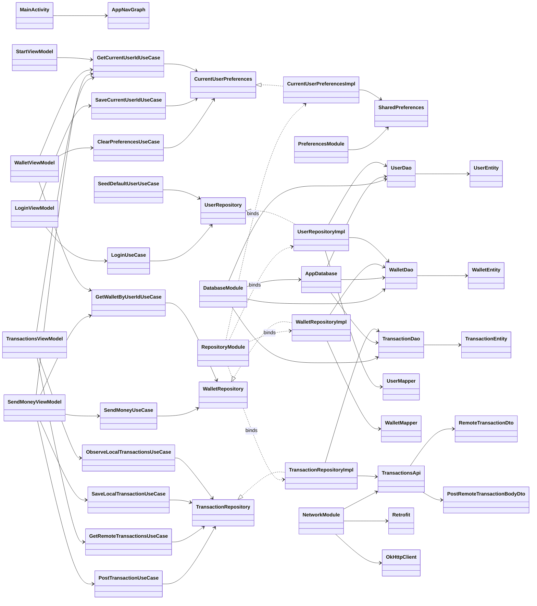
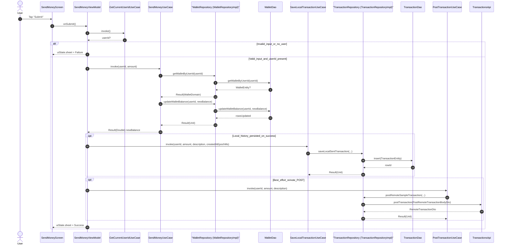
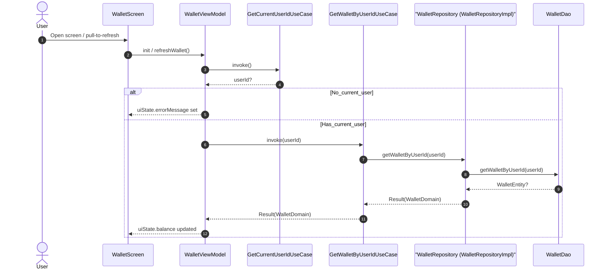
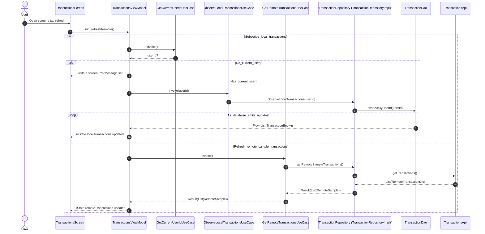

# Maya-Martin-Avery (Android)

Android app built with Kotlin + Jetpack Compose.

## Requirements

- **Android Studio**: a recent stable version (compatible with **Android Gradle Plugin 8.9.1**)
- **JDK**: **11** (this project targets JVM 11)
- **Android SDK**:
  - **compileSdk / targetSdk**: 35
  - **minSdk**: 24

## Run the app (Android Studio)

1. Open the project folder in Android Studio.
2. If prompted, let Android Studio import/sync the Gradle project.
3. Select an emulator or a connected device.
4. Click **Run** (the green play button).

## Run the app (Gradle CLI)

### macOS / Linux

```bash
./gradlew :app:assembleDebug
./gradlew :app:installDebug
```

### Windows (PowerShell)

```powershell
.\gradlew.bat :app:assembleDebug
.\gradlew.bat :app:installDebug
```

## Default credentials

The app seeds a default user on first run:

- **Username**: `admin`
- **Password**: `admin`

## Run local unit tests

Local unit tests live under `app/src/test/` and run on the JVM (no emulator/device required).

### Android Studio

- Open a test file in `app/src/test/`, then click the **Run** gutter icon next to a test/class, or
- Use **Gradle** tool window → `:app` → `Tasks` → `verification` → `testDebugUnitTest`.

### Gradle CLI

#### macOS / Linux

```bash
./gradlew :app:testDebugUnitTest
```

#### Windows (PowerShell)

```powershell
.\gradlew.bat :app:testDebugUnitTest
```

### Test reports

- **HTML report**: `app/build/reports/tests/testDebugUnitTest/index.html`
- **XML results**: `app/build/test-results/testDebugUnitTest/`

## Troubleshooting

- **Gradle sync fails / wrong Java version**: make sure Android Studio / your terminal is using **JDK 11**.
- **Clean build**:
  - macOS / Linux: `./gradlew clean`
  - Windows: `.\gradlew.bat clean`

## Design documentation

The app follows a simple layered architecture:

- **Presentation**: Jetpack Compose screens + `ViewModel`s
- **Domain**: use cases + repository interfaces + domain models
- **Data**: Room (local persistence) + Retrofit (remote sample API) + repository implementations

### Class diagram



### Sequence diagrams

#### Send money flow



#### Wallet load / refresh flow



#### Transactions screen (local + remote)



